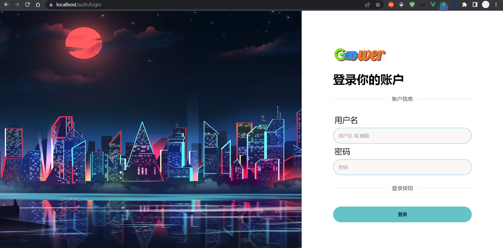

[TOC]

# Go/Gin Gower Web Monolithic Pattern


[Chinese](README.md)|[English](README_EN.md)

[](tests/benchmarks/benchmark) [](https://github.com/falling-ts/gower/actions) []()

---

Gower is a rapid start framework for Web based on [Go/Gin](https://github.com/gin-gonic/gin). The core architectural ideas are mainly inspired by the design philosophy of [Laravel](https://github.com/laravel/laravel). The directory structure is similar to Laravel, and the functions are basically the same. Based on the routing design of Go/Gin, it aims to improve the elegance of code development while ensuring basic performance. By leveraging Go's reflection and type assertion mechanisms, it implements dependency injection, placing parameter validation and model initialization before logic, which greatly simplifies the code.

The monolithic pattern can only occupy one port to provide a set of services.

Go/Gin Gower Work can assemble multiple monolithic patterns to achieve a microservice architecture [gower-work](https://github.com/falling-ts/gower-work)

Main Features:

- Commands as the core, combining command-line tools with the built program
- Services and service providers, bound through keys and functions, achieving dynamic service construction
- Services communicate through dependency injection, avoiding circular dependency traps
- Business as the core, core content is provided by the app, and the app obtains service capabilities through service providers
- Gin routing function packaging, achieving custom parameters and return values for controller methods, i.e., free controllers
- Controller methods inject request structures, achieving automatic request parameter validation
- Can be used for both monolithic and front-end/back-end separation
- The front end uses Vite to achieve library packaging mode, providing css and js for templates
- Overall environment, divided into development, testing, and production, with separate environment files for front-end and back-end
- Overall release, mainly provided by Docker for containerized operation, the main benefit is avoiding problems caused by inconsistent environments

System Requirements:

> go >= v1.23
>
> nodejs >= v16.13
>
> pnpm >= v7.0
>
> docker >= v20.10
>
> docker compose >= v2.0
>
> git >= 2.39

## Quick Start [Monolithic Pattern]

### Source Code Installation [Recommended]

#### 1. Execute Remote Compilation Installation

```shell
$ go install -tags cli github.com/falling-ts/gower@latest
```

> Verification: `$ gower --version`
>
> Currently installed in the system global environment

#### 2. Create a Project, Auto Initialization

```shell
$ gower create my-project
```

### Run the Project

> This will execute project creation, file initialization, environment setup, repository setup, front-end and back-end dependencies, and benchmark tests

#### 1. Using Docker

```shell
$ cd my-project
$ ./docker/run-dev
```

#### 2. Using Goland for Debugging

Open the project in Goland, find the Gower Run configuration, modify the working directory, select the module, and finally run in Debug mode to enable breakpoint debugging.

#### 3. Using Gradle to Run

- Install the Gradle plugin in Goland in advance
- When opening my-project with Goland for the first time, it will prompt `Found Gradle 'my-project' build script`, then click `Load Gradle project`, which will initialize the Gradle build system
- Finally, find Run under dev in the right Gradle tasks and run it.

### Using Git to Install

#### 1. Download

```shell
$ git clone https://github.com/falling-ts/gower.git
or
$ git clone https://gitee.com/falling-ts/gower.git
```

#### 2. Switch to Release Version

```shell
git checkout v0.6.0
```

> After switching, you can delete the `.git` directory and create your own repository

#### 3. Install Front-end and Back-end Dependencies

```shell
$ pnpm install
$ go mod tidy
$ go install -tags cli
```

> Note: First configure an acceleration proxy at [goproxy.cn](https://goproxy.cn), then use `go mod tidy`

#### 4. Initialize Environment

In the root directory, copy out two front-end environment files `.env.test` and `.env.prod`

In the `envs/` directory, copy out two back-end environment files `.env.test` and `.env.prod`

Generate APP and JWT keys

```shell
$ gower init key
$ gower jwt key
```

#### 5. Run dev Development Environment Using Docker

```shell
$ ./docker/run-dev
```

> Tested on Windows, if there are issues with other systems, please raise issues

#### 6. Without Using Docker

##### Build the Front End

```shell
$ npm run dev
```

> This will build js, css, and images content in `public/static`

##### Build the Back End and Run

```shell
$ go test
$ go install
$ gower run # Execute in the project root directory, remember to add $GOPATH/bin to the environment variable
```

> If you need to package static resources, execute `go install -tags tmpl,static`

###### Tags:

```
test: Package program files for the test environment
prod: Package program files for the production environment
tmpl: Package templates
static: Package static resources
cli: Command-line mode
```

> The benefit of packaging these contents is that you don't need to worry about what needs to be carried when migrating the program, as everything is packaged into the program, making it highly flexible

## Quick Development

### Create a Controller

```shell
$ gower make --controller Hello
```

`app/http/controllers/hello_controller.go`

```shell
package controllers

import (
    "gower/app"
    "gower/app/http/requests"
    "gower/services"
)

type HelloController struct {
    app.Controller
}

var Hello = new(HelloController)

// Index Get Page
func (*HelloController) Index(req *requests.HelloRequest) (services.Response, error) {
    return res.Ok("home/hello", app.Data{
        "name": req.Name,
    }), nil
}
```

### Create a Request

```shell
$ gower make --request Hello
```

`app\http\requests\hello_request.go`

```shell
package requests

import "gower/app"

type HelloRequest struct {
    app.Request

    Name *string `form:"name" json:"name" binding:"required"`
}
```

### Create a Model

```shell
$ gower make --model Hello
```

`app\models\hello.go`

```shell
package models

func init() {
    migrate(new(Hello))
}

type Hello struct {
    Model

    Name *string `gorm:"type:string;default:'';comment:Name"`
}
```

> Note: If the command outputs a lot of debug information, it's because the APP_MODE in envs/.env.dev is set to development mode. Change it to test mode.

### Add Routes

`routes/web.go`

```shell
package routes

import (
    web "gower/app/http/controllers"
    mws "gower/app/http/middlewares"
    "gower/public"
)

func init() {
    // ...

    route.GET("/hello", web.Hello.Index)
}
```

### Execute Request

```shell
$ curl -i http://localhost:8080/hello?name=Gower
```

## Third-party Libraries and Content, Expressing Gratitude to Open Source

```
github.com/alexedwards/argon2id v1.0.0
github.com/caarlos0/env/v7 v7.1.0
github.com/gin-contrib/cors v1.7.2
github.com/gin-gonic/gin v1.10.0
github.com/glebarez/sqlite v1.11.0
github.com/go-playground/locales v0.14.1
github.com/go-playground/universal-translator v0.18.1
github.com/go-playground/validator/v10 v10.22.1
github.com/go-sql-driver/mysql v1.8.1
github.com/golang-jwt/jwt/v5 v5.2.1
github.com/jaevor/go-nanoid v1.4.0
github.com/joho/godotenv v1.5.1
github.com/patrickmn/go-cache v2.1.0+incompatible
github.com/stretchr/testify v1.9.0
github.com/urfave/cli/v2 v2.27.5
go.uber.org/zap v1.27.0
golang.org/x/crypto v0.28.0
gorm.io/driver/mysql v1.5.7
gorm.io/gorm v1.25.12

github.com/rclone/rclone v1.62.2
github.com/laravel/laravel
github.com/moby/moby
github.com/docker/compose

FROM caddy:2.6
FROM grafana/grafana:9.4.3
FROM grafana/loki:main-0295fd4
FROM mysql/mysql-server:5.7.41
FROM grafana/promtail:main-0295fd4
FROM pingcap/tidb:v6.5.1

nodejs
pnpm
"animate.css": "^4.1.1",
"autoprefixer": "^10.4.13",
"daisyui": "^2.51.2",
"jquery": "^3.6.3",
"js-cookie": "^3.0.1",
"jssha": "^3.3.0",
"postcss": "8.4.31",
"resize-observer-polyfill": "^1.5.1",
"simplebar": "^6.2.1",
"stylus": "^0.59.0",
"tailwindcss": "^3.2.7",
"vue": "^3.2.47"
"@rollup/plugin-replace": "^5.0.2",
"@types/crypto-js": "^4.1.1",
"@types/jquery": "^3.5.16",
"@types/js-cookie": "^3.0.3",
"@types/node": "^18.15.10",
"@types/vue": "^2.0.0",
"@vitejs/plugin-vue": "^4.0.0",
"cross-env": "^7.0.3",
"vite": "5.4.6"
```

## Documentation

[Wiki Address](https://gitee.com/falling-ts/gower/wikis/Home)
[Domestic Documentation Address](https://learnku.com/docs/go-gin-gower/0.2.0)

## LICENSE

[MIT License](LICENSE)

## Home Page


## Example Themes

By modifying `VIEW_THEME` in `.env.xxx`, see [DaisyUI](https://daisyui.com/docs/themes/) for details

### cupcake



### forest


### halloween


### lofi


### synthwave


