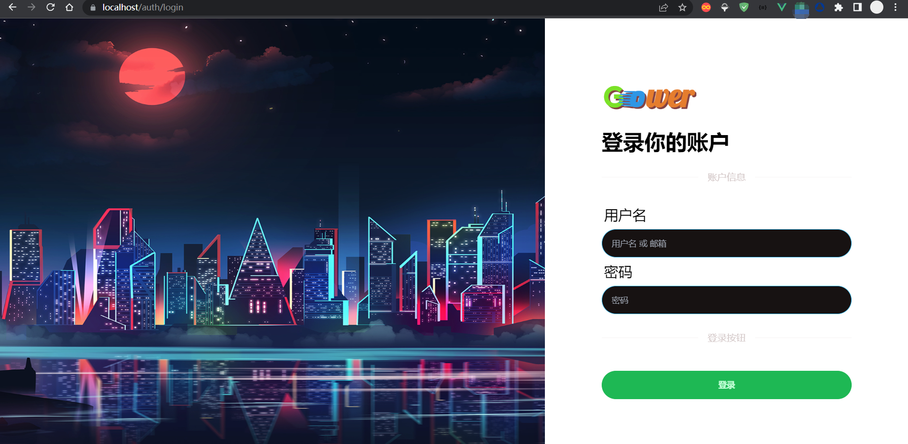

# Go/Gin Gower Web 单体模式


[中文](README.md)|[English](README_EN.md)

[]()

---

建议使用 [Go/Gin Gower Workspace](https://gitee.com/falling-ts/gower-work) 工作区模式, 可以创建多个单体项目, 能够统一使用 Gradle 进行多个单体项目的运行, 构建与部署.

Gower 是基于 [Go/Gin](https://github.com/gin-gonic/gin) 的 Web 快速启动框架, 已在控制器的方法参数级上实现了 IoC 依赖注入功能.

系统要求:

> go >= v1.23
>
> nodejs >= v18.20
>
> pnpm >= v9.12
>
> docker >= v20.10 [非必要]
>
> docker compose >= v2.0 [非必要]
>
> git >= 2.39
>
> gradle >= 8.10.2
>
> jdk >= 23

## 快速开始[单体模式]

### 源码安装

#### 1.配置 GOPROXY

```shell
$ export GOPROXY=https://mirrors.aliyun.com/goproxy/,direct
```

> windows 系统, 打开环境变量, 创建新用户变量, 变量名: `GOPROXY`, 变量值: `https://mirrors.aliyun.com/goproxy/,direct`

#### 2.执行远程编译安装

```shell
$ go install -tags cli gitee.com/falling-ts/gower@latest
```

> 验证结果: `$ gower --version`
>
> 当前安装在系统全局环境中

#### 3.创建项目, 自动初始化

```shell
$ gower create my-project
```

### 运行项目

> 将执行创建项目, 初始化文件, 环境, 仓库, 前后端依赖, 执行基准测试

#### 1.使用 Docker

```shell
$ cd my-project
$ ./docker/run-dev
```

#### 2.使用 GoLand 进行 Debug

用 GoLand 打开项目后, 找到 my-project 运行配置, 修改工作目录, 并选择模块, 最后 Debug 运行, 就可以进行断点调试了.

#### 3.使用 gradle 运行

- 单项目模式需要将 `build.gradle` 开头的 `"org.hidetake.ssh"` 插件注释去掉
- 提前在 GoLand 中安装好 gradle 插件
- 修改 `build.gradle`, 去掉开头插件引用的注释
- 第一次使用 GoLand 打开 my-project 时, 会提醒 `找到Gradle 'my-project' 构建脚本`, 然后点击 `加载 Gradle 项目`, 会初始化 gradle 构建体系
- 最后, 在右侧 gradle 任务中找到 dev 下的 Run, 运行它即可.

> 如果需要打包静态资源请执行 `go install -tags tmpl,static`

###### tags:

```
test: 打包测试环境的程序文件
prod: 打包生成环境的程序文件
tmpl: 打包模板
static: 打包静态资源
cli: 命令行模式
```

> 打包这些内容好处是无需关心程序迁移时, 需要携带的内容, 因为都打包进程序了, 一个文件就是整套系统, 灵活性极高

## 快速开发

### 创建控制器

```shell
$ gower make --controller Hello
```

`app/http/controllers/hello_controller.go`

```go
package controllers

import (
    "my-project/app"
    "my-project/app/http/requests"
    "my-project/services"
)

type HelloController struct {
    app.Controller
}

var Hello = new(HelloController)

// Index 获取页面
func (*HelloController) Index(req *requests.HelloRequest) (services.Response, error) {
    return res.Ok("home/hello", app.Data{
        "name": req.Name,
    }), nil
}

```

### 创建请求

```shell
$ gower make --request Hello
```

`app\http\requests\hello_request.go`

```go
package requests

import "my-project/app"

type HelloRequest struct {
    app.Request

    Name *string `form:"name" json:"name" binding:"required"`
}
```

### 创建模型

```shell
$ gower make --model Hello
```

`app\models\hello.go`

```go
package models

func init() {
    migrate(new(Hello))
}

type Hello struct {
    Model

    Name *string `gorm:"type:string;default:'';comment:名称"`
}
```

> 注: 如果命令输出很多 Debug 内容, 那是因为 envs/.env.dev 的 APP_MODE 是开发模式, 修改为测试模式就可以了

### 添加路由

`routes/web.go`

```go
package routes

import (
    web "my-project/app/http/controllers"
    mws "my-project/app/http/middlewares"
    "my-project/public"
)

func init() {
    // ...

    route.GET("/hello", web.Hello.Index)
}
```

### 执行请求

```shell
$ curl -i http://localhost:8080/hello?name=Gower
```

## 使用的第三方库和内容, 同时表达对开源的感谢

```yaml
github.com/alexedwards/argon2id v1.0.0
github.com/caarlos0/env/v7 v7.1.0
github.com/gin-contrib/cors v1.7.2
github.com/gin-gonic/gin v1.10.0
github.com/glebarez/sqlite v1.11.0
github.com/go-playground/locales v0.14.1
github.com/go-playground/universal-translator v0.18.1
github.com/go-playground/validator/v10 v10.22.1
github.com/go-sql-driver/mysql v1.8.1
github.com/golang-jwt/jwt/v5 v5.2.1
github.com/jaevor/go-nanoid v1.4.0
github.com/joho/godotenv v1.5.1
github.com/patrickmn/go-cache v2.1.0+incompatible
github.com/stretchr/testify v1.9.0
github.com/urfave/cli/v2 v2.27.5
go.uber.org/zap v1.27.0
golang.org/x/crypto v0.28.0
gorm.io/driver/mysql v1.5.7
gorm.io/gorm v1.25.12

github.com/rclone/rclone v1.62.2
github.com/laravel/laravel
github.com/moby/moby
github.com/docker/compose

FROM caddy:2.6
FROM grafana/grafana:9.4.3
FROM grafana/loki:main-0295fd4
FROM mysql/mysql-server:5.7.41
FROM grafana/promtail:main-0295fd4
FROM pingcap/tidb:v6.5.1

nodejs
pnpm
"animate.css": "^4.1.1",
"autoprefixer": "^10.4.20",
"daisyui": "^4.12.14",
"jquery": "^3.7.1",
"js-cookie": "^3.0.5",
"jssha": "^3.3.1",
"postcss": "^8.4.49",
"resize-observer-polyfill": "^1.5.1",
"simplebar": "^6.2.7",
"stylus": "^0.59.0",
"tailwindcss": "^3.4.15",
"vue": "^3.5.13"
"@iconify/json": "^2.2.276",
"@iconify/tailwind": "^1.1.3",
"@rollup/plugin-replace": "^5.0.7",
"@types/crypto-js": "^4.2.2",
"@types/jquery": "^3.5.32",
"@types/js-cookie": "^3.0.6",
"@types/node": "^18.19.65",
"@types/vue": "^2.0.0",
"@vitejs/plugin-vue": "^4.6.2",
"cross-env": "^7.0.3",
"vite": "5.4.6"
```

## 文档

[文档地址](https://falling-ts.github.io/gower-docs)

## LICENSE

[MIT License](LICENSE)

## 主页页面


## 示例主题

通过修改 `.env.xxx` 的 `VIEW_THEME`, 详情见 [DaisyUI](https://daisyui.com/docs/themes/)

### cupcake


### forest



### halloween


### lofi


### synthwave


