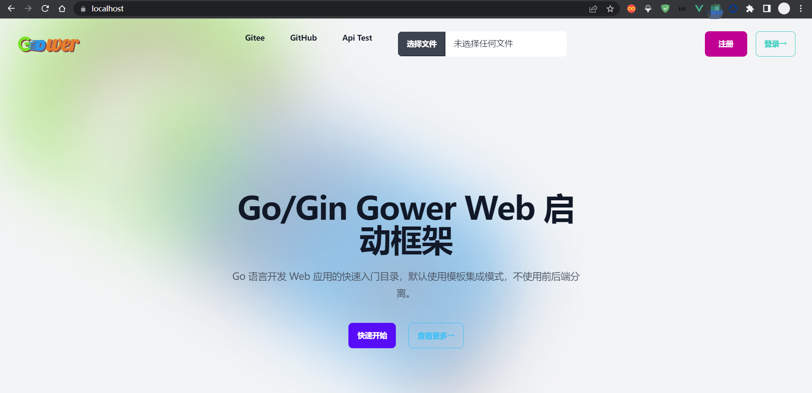
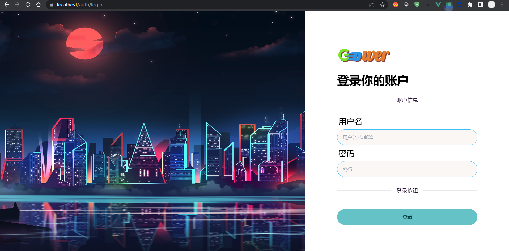
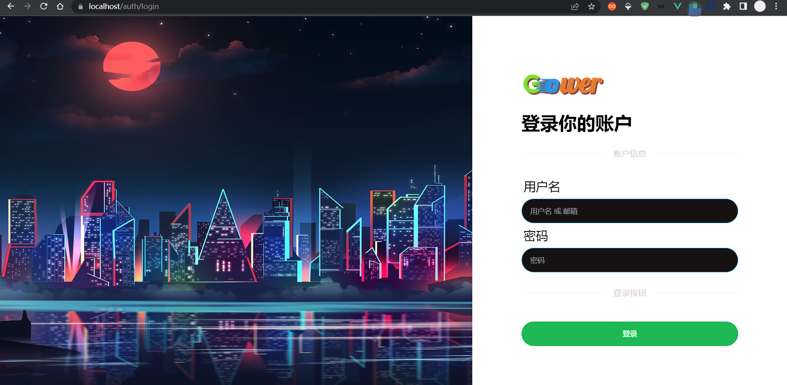
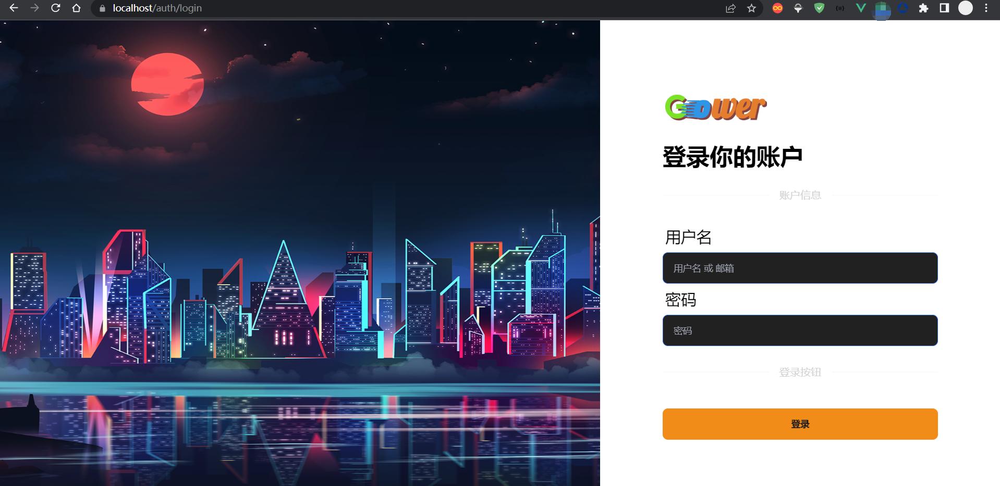
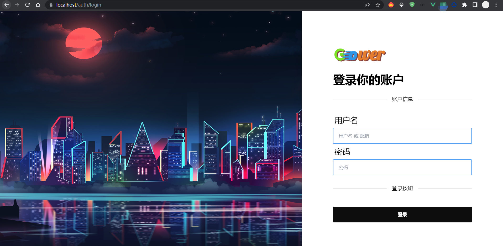
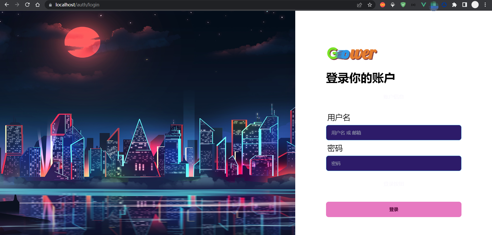

# Go/Gin Gower Web Monolithic Pattern


[Chinese](README.md)|[English](README_EN.md)

[]()

---

It is recommended to use the [Go/Gin Gower Workspace](https://gitee.com/falling-ts/gower-work) mode, which allows you to create multiple monolithic projects and uniformly manage the running, building, and deployment of multiple monolithic projects using Gradle.

Gower is a quick-start framework for Web based on [Go/Gin](https://github.com/gin-gonic/gin), and has implemented IoC dependency injection at the method parameter level in controllers.

System requirements:

> go >= v1.23
>
> nodejs >= v18.20
>
> pnpm >= v9.12
>
> docker >= v20.10 [optional]
>
> docker compose >= v2.0 [optional]
>
> git >= 2.39
>
> gradle >= 8.10.2
>
> jdk >= 23

## Quick Start [Monolithic Mode]

### Source Code Installation

#### 1. Configure GOPROXY

```shell
$ export GOPROXY=https://mirrors.aliyun.com/goproxy/,direct
```


> For Windows systems, open environment variables, create a new user variable, variable name: `GOPROXY`, variable value: `https://mirrors.aliyun.com/goproxy/,direct`

#### 2. Execute Remote Compilation and Installation

```shell
$ go install -tags cli gitee.com/falling-ts/gower@latest
```


> Verify the result: `$ gower --version`
>
> The current installation is in the system global environment

#### 3. Create a Project and Initialize Automatically

```shell
$ gower create my-project
```


### Run the Project

> This will execute project creation, file initialization, environment setup, repository initialization, front-end and back-end dependencies, and baseline testing.

#### 1. Using Docker

```shell
$ cd my-project
$ ./docker/run-dev
```


#### 2. Using GoLand for Debugging

Open the project with GoLand, find the my-project run configuration, modify the working directory, select the module, and then run it in Debug mode to set breakpoints and debug.

#### 3. Using Gradle to Run

- For single project mode, remove the comment from the `"org.hidetake.ssh"` plugin at the beginning of `build.gradle`.
- Install the gradle plugin in GoLand in advance.
- Modify `build.gradle` and remove the comment from the plugin reference at the beginning.
- When opening my-project with GoLand for the first time, a prompt will appear saying `Found Gradle 'my-project' build script`. Click `Load Gradle project` to initialize the Gradle build system.
- Finally, find Run under the dev section in the right-hand gradle tasks and run it.

> If you need to package static resources, execute `go install -tags tmpl,static`

###### Tags:

```
test: Package test environment program files
prod: Package production environment program files
tmpl: Package templates
static: Package static resources
cli: Command-line mode
```


> The benefit of packaging these contents is that you don't need to worry about what needs to be carried when migrating the program, as everything is packaged into one file, making it highly flexible.

## Rapid Development

### Create a Controller

```shell
$ gower make --controller Hello
```


`app/http/controllers/hello_controller.go`

```go
package controllers

import (
    "my-project/app"
    "my-project/app/http/requests"
    "my-project/services"
)

type HelloController struct {
    app.Controller
}

var Hello = new(HelloController)

// Index Get page
func (*HelloController) Index(req *requests.HelloRequest) (services.Response, error) {
    return res.Ok("home/hello", app.Data{
        "name": req.Name,
    }), nil
}
```


### Create a Request

```shell
$ gower make --request Hello
```


`app\http\requests\hello_request.go`

```go
package requests

import "my-project/app"

type HelloRequest struct {
    app.Request

    Name *string `form:"name" json:"name" binding:"required"`
}
```


### Create a Model

```shell
$ gower make --model Hello
```


`app\models\hello.go`

```go
package models

func init() {
    migrate(new(Hello))
}

type Hello struct {
    Model

    Name *string `gorm:"type:string;default:'';comment:Name"`
}
```


> Note: If the command outputs a lot of debug information, it's because the `APP_MODE` in `envs/.env.dev` is set to development mode. Change it to test mode.

### Add Routes

`routes/web.go`

```go
package routes

import (
    web "my-project/app/http/controllers"
    mws "my-project/app/http/middlewares"
    "my-project/public"
)

func init() {
    // ...

    route.GET("/hello", web.Hello.Index)
}
```


### Execute the Request

```shell
$ curl -i http://localhost:8080/hello?name=Gower
```


## Third-party Libraries and Content, Expressing Thanks to Open Source

```yaml
github.com/alexedwards/argon2id v1.0.0
github.com/caarlos0/env/v7 v7.1.0
github.com/gin-contrib/cors v1.7.2
github.com/gin-gonic/gin v1.10.0
github.com/glebarez/sqlite v1.11.0
github.com/go-playground/locales v0.14.1
github.com/go-playground/universal-translator v0.18.1
github.com/go-playground/validator/v10 v10.22.1
github.com/go-sql-driver/mysql v1.8.1
github.com/golang-jwt/jwt/v5 v5.2.1
github.com/jaevor/go-nanoid v1.4.0
github.com/joho/godotenv v1.5.1
github.com/patrickmn/go-cache v2.1.0+incompatible
github.com/stretchr/testify v1.9.0
github.com/urfave/cli/v2 v2.27.5
go.uber.org/zap v1.27.0
golang.org/x/crypto v0.28.0
gorm.io/driver/mysql v1.5.7
gorm.io/gorm v1.25.12

github.com/rclone/rclone v1.62.2
github.com/laravel/laravel
github.com/moby/moby
github.com/docker/compose

FROM caddy:2.6
FROM grafana/grafana:9.4.3
FROM grafana/loki:main-0295fd4
FROM mysql/mysql-server:5.7.41
FROM grafana/promtail:main-0295fd4
FROM pingcap/tidb:v6.5.1

nodejs
pnpm
"animate.css": "^4.1.1",
"autoprefixer": "^10.4.20",
"daisyui": "^4.12.14",
"jquery": "^3.7.1",
"js-cookie": "^3.0.5",
"jssha": "^3.3.1",
"postcss": "^8.4.49",
"resize-observer-polyfill": "^1.5.1",
"simplebar": "^6.2.7",
"stylus": "^0.59.0",
"tailwindcss": "^3.4.15",
"vue": "^3.5.13"
"@iconify/json": "^2.2.276",
"@iconify/tailwind": "^1.1.3",
"@rollup/plugin-replace": "^5.0.7",
"@types/crypto-js": "^4.2.2",
"@types/jquery": "^3.5.32",
"@types/js-cookie": "^3.0.6",
"@types/node": "^18.19.65",
"@types/vue": "^2.0.0",
"@vitejs/plugin-vue": "^4.6.2",
"cross-env": "^7.0.3",
"vite": "5.4.6"
```


## Documentation

[Documentation Address](https://falling-ts.github.io/gower-docs)

## LICENSE

[MIT License](LICENSE)

## Home Page



## Example Themes

By modifying `VIEW_THEME` in `.env.xxx`, see [DaisyUI](https://daisyui.com/docs/themes/) for details.

### cupcake



### forest



### halloween



### lofi



### synthwave


